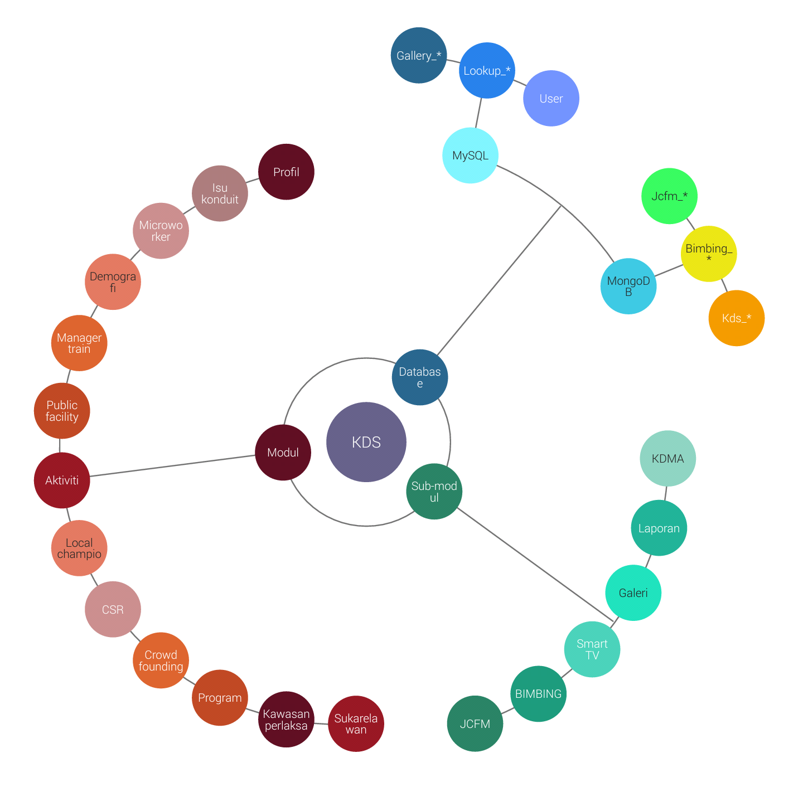
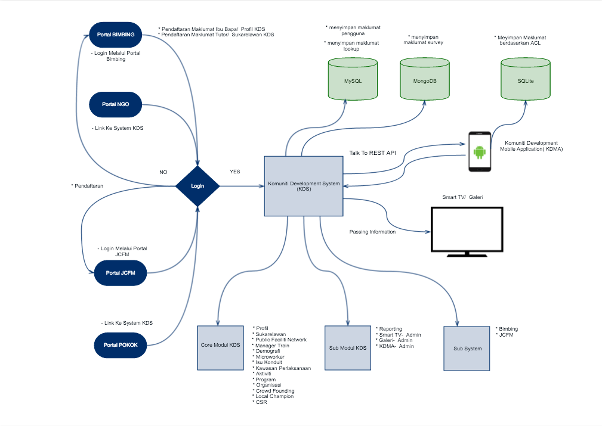

KDS System - Yii2 Advanced Project Template
=======================================

## System Timeline

MODUL | ESTIMATE TIME | PART OFF | ESTIMATE TIME
----- | ------------- | -------- | -------------
Profil | 4w | JCFM | - 
Sukarelawan | 5d | Bimbing | 8w
Public Facility Network | 4w | Reporting | 8w
Manager Train | 4d | Smart TV | 8w
Demografi | 4d | Galeri | 3w
Microworker | 1w | KDMA - admin panel | 4w
Isu Konduit | 4d |
Kawasan Perlaksanaan | 2d |
Aktiviti | 2d |
Program | 3d |
Organisasi | 1d |
Crowd Founding | - |
Local Champion | - |
CSR | -

## System structure

1. Backend
	* Modul (MVC)
		* Profil
		* Sukarelawan
		* Public Facility Network
		* Manager Train
		* Demografi
		* Microworker
		* Isu Konduit
		* Kawasan Perlaksanaan
		* Aktiviti
		* Program
		* Organisasi
		* Crowd Founding
		* Local Champion
		* CSR

	* Sub Modules (MVC)
		* JCFM
		* BIMBING
		* Laporan
		* Smart TV
		* Galeri
		* KDMA

2. Common

	* Config (Local Server)
		* 192.168.0.20 - MySQL
		* 192.168.0.115 - MongoDB

	* Models
		* Lookup_*
		* User

3. Frontend
