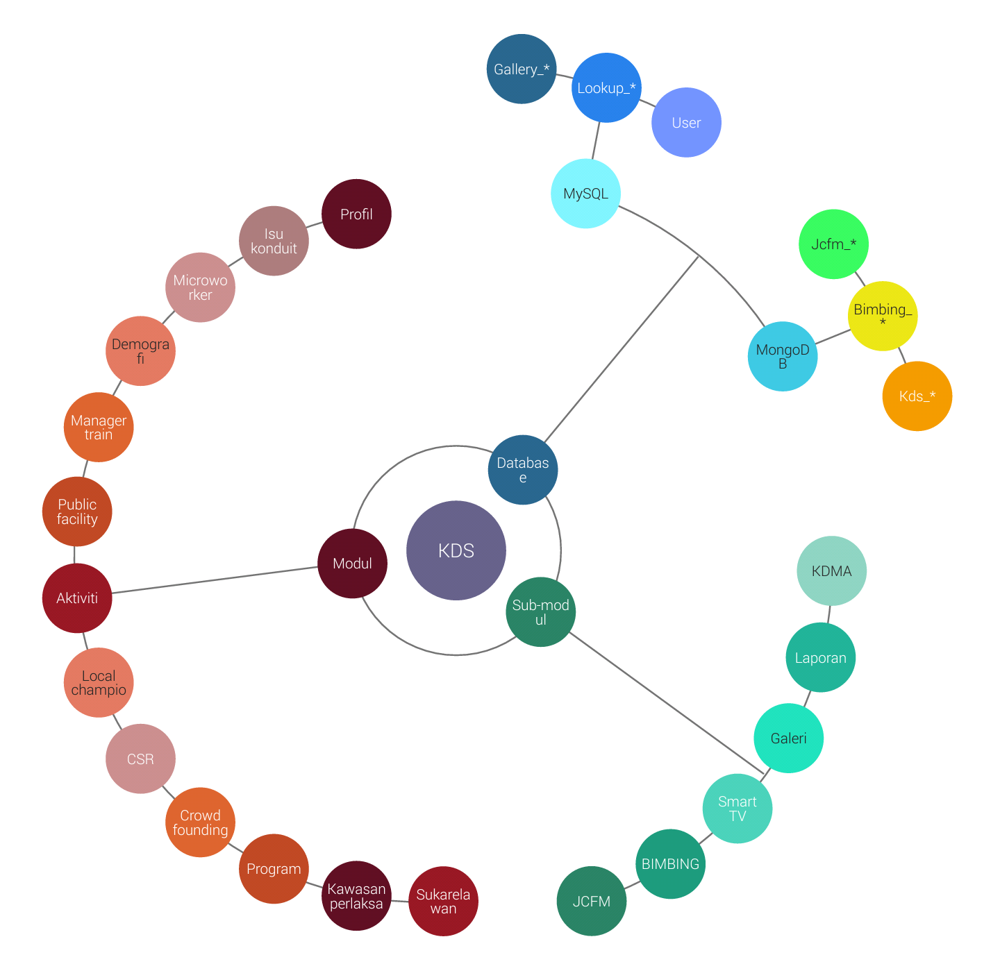

KDS System - Yii2 Advanced Project Template
=======================================

## System structure

1. Backend
	* Modul (MVC)
		* Profil
		* Sukarelawan
		* Public Facility Network
		* Manager Train
		* Demografi
		* Microworker
		* Isu Konduit
		* Kawasan Perlaksanaan
		* Aktiviti
		* Program
		* Organisasi
		* Crowd Founding
		* Local Champion
		* CSR

	* Sub Modules (MVC)
		* JCFM
		* BIMBING
		* Laporan
		* Smart TV
		* Galeri
		* KDMA

2. Common

	* Config (Local Server)
		* 192.168.0.20 - MySQL
		* 192.168.0.115 - MongoDB

	* Models
		* Lookup_*
		* User

3. Frontend
